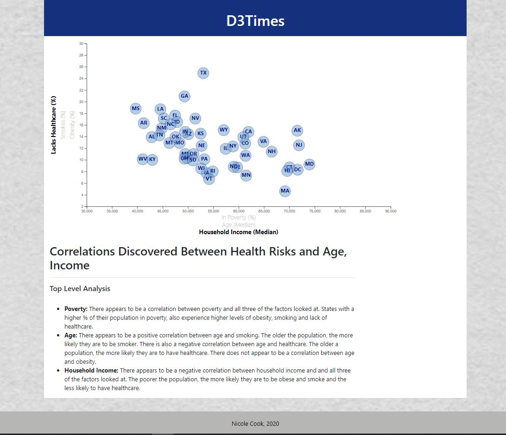

# D3 Homework - Data Journalism and D3

## Before you Begin

- Webpage can be found here: [D3 Times](https://nicole1701.github.io/census-data-D3/)
- The data set included with the assignment is based on 2014 ACS 1-year estimates and includes data on rates of income, obesity, poverty, etc. by state: [Data Set](https://data.census.gov/cedsci/)

## Top Level Analysis

- **Poverty:** There appears to be a correlation between poverty and all three of the factors looked at. States with a higher % of their population in poverty, also experience higher levels of obesity, smoking and lack of healthcare.
- **Age:** There appears to be a positive correlation between age and smoking. The older the population, the more likely they are to be smoker. There is also a negative correlation between age and healthcare. The older a population, the more likely they are to have healthcare. There does not appear to be a correlation between age and obesity.
- **Household Income:** There appears to be a negative correlation between household income and and all three of the factors looked at. The poorer the population, the more likely they are to be obese and smoke and the less likely to have healthcare.

## Background

Welcome to the newsroom! You've just accepted a data visualization position for a major metro paper. You're tasked with analyzing the current trends shaping people's lives, as well as creating charts, graphs, and interactive elements to help readers understand your findings.

The editor wants to run a series of feature stories about the health risks facing particular demographics. She's counting on you to sniff out the first story idea by sifting through information from the U.S. Census Bureau and the Behavioral Risk Factor Surveillance System.

## Core Assignment: D3 Dabbler

You need to create a scatter plot between two of the data variables such as `Healthcare vs. Poverty` or `Smokers vs. Age`.

Using the D3 techniques we taught you in class, create a scatter plot that represents each state with circle elements. You'll code this graphic in the `app.js` file of your homework directory—make sure you pull in the data from `data.csv` by using the `d3.csv` function.

- Include state abbreviations in the circles.

- Create and situate your axes and labels to the left and bottom of the chart.

## Bonus: Impress the Boss (Optional Assignment)

#### 1. More Data, More Dynamics

You're going to include more demographics and more risk factors. Place additional labels in your scatter plot and give them click events so that your users can decide which data to display. Animate the transitions for your circles' locations as well as the range of your axes. Do this for two risk factors for each axis. Or, for an extreme challenge, create three for each axis.

#### 2. Incorporate d3-tip

While the ticks on the axes allow us to infer approximate values for each circle, it's impossible to determine the true value without adding another layer of data. Enter tooltips: developers can implement these in their D3 graphics to reveal a specific element's data when the user hovers their cursor over the element. Add tooltips to your circles and display each tooltip with the data that the user has selected. Use the `d3-tip.js` plugin developed by [Justin Palmer](https://github.com/Caged)—we've already included this plugin in your assignment directory.

## Screenshot of Final Page

